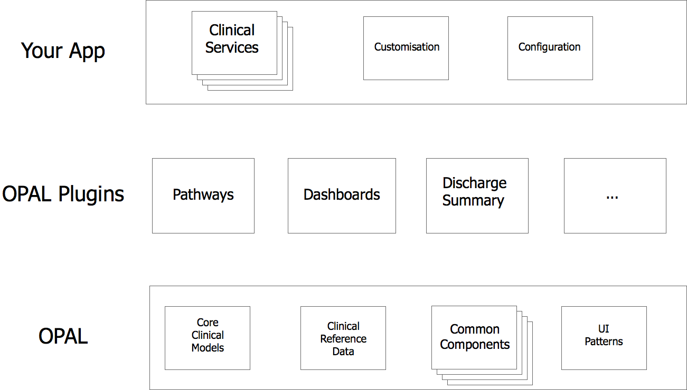

# Components of an OPAL application

OPAL applications will typically be made up of several types of components.

### OPAL

The core OPAL framework provides you with a range of commonly required elements
of clinical applications.

It contains a core [data model](datamodel.md) for persisting clinical information,
as well core [clinical archetypes](archetypes.md) out of the box that build on many
years of collaboratively modelling clinical concepts by medical domain experts.

OPAL also makes it easy to integrate standard clinical [reference data](referencedata.md)
into your application - things like medical diagnoses, tests, drugs et cetera.

Some common functional components end up in to most clinical applications, and many
of these come with OPAL as "batteries included" - immediately available modular features
that can be simply re-used without having to reinvent the wheel.

For example:

* [Patient lists](list_views.md)
* [Search](search.md)
* Authentication and [Permissions](roles_and_permissions.md)
* [Forms for data entry](forms.md)
* [JSON based REST APIs](json_api.md) for all of your models
* ... and [many more](topic-guides.md)...

### Plugins

OPAL plugins are intended to provide high quality generic, composable, re-usable chunks of
functionality that can be "dropped in" to an application. For example, installing the
[Dashboards](https://github.com/openhealthcare/opal-dashboards) plugin allows you to easily
create clinical dashboards within your application. The
[Referral](https://github.com/openhealthcare/opal-referral) plugin provides the plumbing for
building complex inter-team referrals within an institution.

Plugins have a [rich plugin API](plugins.md) they can hook into to, and
many examples can be found by inspecting the source of [existing plugins](plugins_list.md).

### Applications

An application is the collection of configuration and bespoke functionality that would be
provided to an individual institution - it's the thing that you would look to deploy.

Example applications include [elCID](https://github.com/openhealthcare/elcid) - a for managing
infection patients, or [OPAL-Renal](https://github.com/openhealthcare/opal-renal) - an MDT &
handover tool for Renal wards.

A hospital might have multiple clinical services running on one application, or multiple
applications that integrate with one another.

### Opinionated but Pluggable

OPAL is an opinionated framework. It expects the developer to structure code in a
certain way.

OPAL expects features to be implemented as single page Angular.js applications, with the server
mostly figuring as an API endpoint for reading and writing data.

That said, the technology stack of Django, Angular & Bootstrap allows the confident user a huge
degree of flexibility when writing their own applications and plugins.

For instance, there is nothing to _stop_ a developer from implementing a part of the functionality
in some other Javascript framework, and simply calling the [JSON API](json_api.md). However, by
doing so, the developer will lose a large collection of pre-existing libraries, conventions et cetera.
While possible, this approach is not likely to be officially supported in the medium term.
