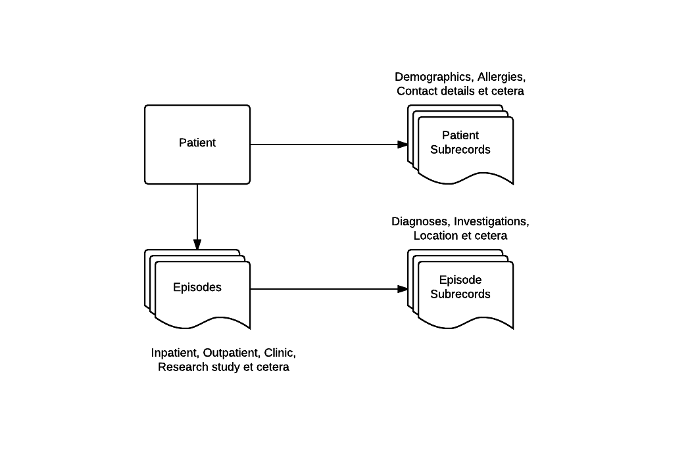

## The OPAL Data model

The OPAL data model allows for patients to have multiple sequential or concurrent
`Episodes of care`. Some information is linked to an `Episode`, some is linked to
a `Patient`.

### Patients

A `Patient` may have many `Episodes`. An `Episode` is something like an Inpatient admission,
a telephone liaison, care under an outpatient clinic, an appointment at a drop in clinic.
Applications or plugins may define their own `Episode` categories, and a common pattern is to
alter the display or available functionality by episode type. (e.g. You may associate
templates for discharge summaries with particular episode types)

A `Patient` will have `Subrecords` (such as e.g. Demographics) which follow them across multiple
episodes. These are information linked to a particular person, and should be implemented as
Django models that inherit from the `opal.models.PatientSubrecord` base class.

### Episodes

An `Episode` is linked to a `Patient`, and will contain some metadata about the type and date
of the episode. The field `Episode.category_name` stores a string representing the relevant
`EpisodeCategory` e.g. ('Inpatient', 'Outpatient', ...), while a category object is returned
from the `episode.category` field. The start and end dates of an `Episode` may be retrieved
from the `start` and `end` properties.

An `Episode` will have `Subrecords` (such as e.g. Diagnosis) which are linked to this episode of
care. These should be implemented as Django models that inherit from the `opal.models.EpisodeSubRecord`
base class.

### Records

A `Subrecord` consists of a collection of fields that constitute a record. For example, one could
implement a Demograpics `Subrecord` as follows:

    class Demographics(PatientSubrecord):
        name             = models.CharField(max_length=255, blank=True)
        hospital_number  = models.CharField(max_length=255, blank=True)
        date_of_birth    = models.DateField(null=True, blank=True)
        ethnicity        = models.CharField(max_length=255, blank=True,
                                            null=True)
        gender           = models.CharField(max_length=255, blank=True,
                                            null=True)

Subrecords also define various properties that will provide metadata about their
display or structure, which are documented in the
[Subrecord reference material](/reference/subrecords/)

### Core Clinical Data Model

OPAL ships with a wide range of core clinical concepts implemented as Abstract Subrecords.
Applications that are generated via the `$ opal startproject` command will automatically
contain concrete implementations of these models in the application.

Full documentation of these models is available in the [Archetypes](archetypes.md) documentation.

### Reference Data

OPAL comes with a set of clinical terminology data models out of the box. - we often
want to link our records to one of these - for example to record a type of condition
a patient might have, or a drug they are taking.

Full documentation of these is available in the [Lookup lists](lookup_lists.md) documentation.
