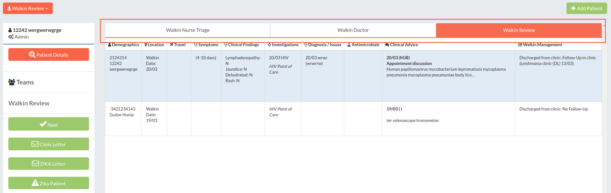
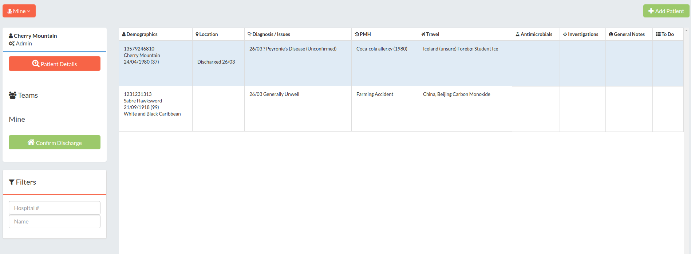
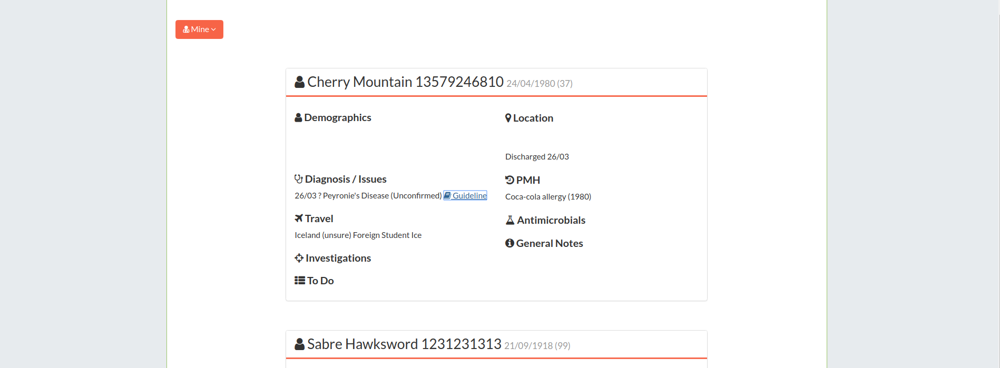
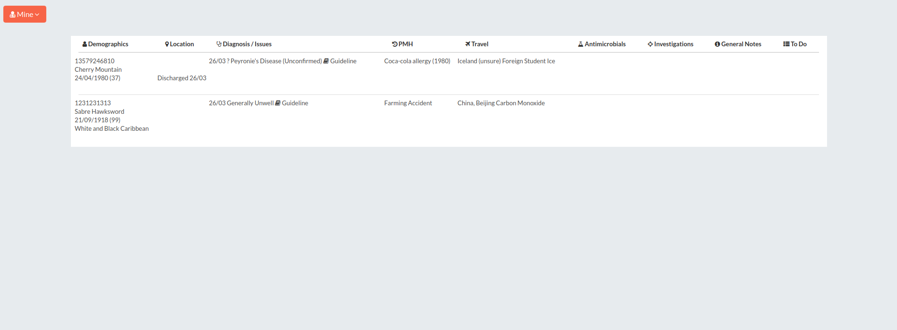

## opal.core.patient_lists

The `patient_lists` module defines a number of classes for working with lists of patients.


### class opal.core.patient_lists.PatientList

#### PatientList.allow_add_patient
Whether we should show the add patient button. Defaults to `True`.

#### PatientList.allow_edit_teams
Whether we should allow the user to edit teams. Defaults to `True`.

#### PatientList.comparator_service
A custom comparator service to set sort order within a list. Defaults to None.
Further information on Comparators can be found in the [Opal Guides](../guides/list_views.md#customising-sort-order-of-episodes) section.

#### PatientList.direct_add
Further information is available in the [Guides section](../guides/list_views.md#direct-add).

#### PatientList.display_name
How we want to refer to this list on screen to users.

#### PatientList.order
Passing an integer to `PatientList.order` will allow you to control the order of display of Patient Lists in dropdowns and other views. Further information is available in the [Guides section](../guides/list_views.md#ordering-lists).

#### PatientList.queryset
Further information is available in the [Guides section](../guides/list_views.md#querysets).

#### PatientList.schema
Further information is available in the [Guides section](../guides/list_views.md#schemas).

#### PatientList.slug
Further information is available in the [Guides section](../guides/list_views.md#slug).

#### PatientList.template_name
If you want to over-ride the default Patient List template `opal/templates/patient_list/spreadsheet.html` with a custom template, or set the Card or Table PatientList templates, you can specify the path of the custom template (relative to `/myapp/templates/`) in this property.

```python
# myapp/patient_lists.py

class MyPatientList(PatientList):
    template_name = 'my_layout.html'
```

Will look for a template at `/myapp/templates/my_layout.html`.

#### PatientList.visible_to
Further information is available in the [Guides section](../guides/list_views.md#access-control).


### class TaggedPatientList
Tagged Patient Lists inherit from Patient Lists - as such they have all of the same methods and properties of Patient Lists.

### Properties

#### TaggedPatientList.tag
The main, or parent tag for this list. Should be lowercase, with no numbers or dashes. Underscores are OK. Further information is available in the [Guides section](../guides/list_views.md#tagged-patient-lists).

#### TaggedPatientList.subtag
The child tag for this list. Should be lowercase, with no numbers or dashes. Underscores are OK.


### class TabbedPatientListGroup
Groups Patient Lists together, to display as tabs at the top of any list in the group.
.

#### TabbedPatientListGroup.for_list
Returns the group for a given PatientList. Raises ValueError if not passed a PatientList.

#### TabbedPatientListGroup.get_member_lists
A hook for dynamically customising the members of this list group. Returns an iterable of PatientLists. Defaults to the `.member_lists` property.

#### TabbedPatientListGroup.get_member_lists_for_user
Returns an iterable of the visible member lists for a given user.

#### TabbedPatientListGroup.member_lists
A list containing the `PatientList` subclasses in this group.

#### TabbedPatientListGroup.visible_to
Predicate function to determine whether this list is meaningfully visible to this user.


## Built-in PatientList Templates

### 'Spreadsheet' PatientList Template
This is the default template, which gives you a 'spreadsheet'-like view of the patient list, with the standard Opal sidebar, containing the default demographic info, tags and action tools.



### 'Card' PatientList Template
This will display the patient list as a series of 'cards', more analogous to a Twitter stream than the spreadsheet-like appearance of the default list.



To use this layout, change your PatientList `template_name` to "patient_lists/layouts/card_list.html".

### 'Table' PatientList Template
This will display the patient list as a wide 'table', similar to the spreadsheet-like appearance of the default list, but without the sidebar.



To use, just change your PatientList `template_name` to "patient_lists/layouts/table_list.html".
